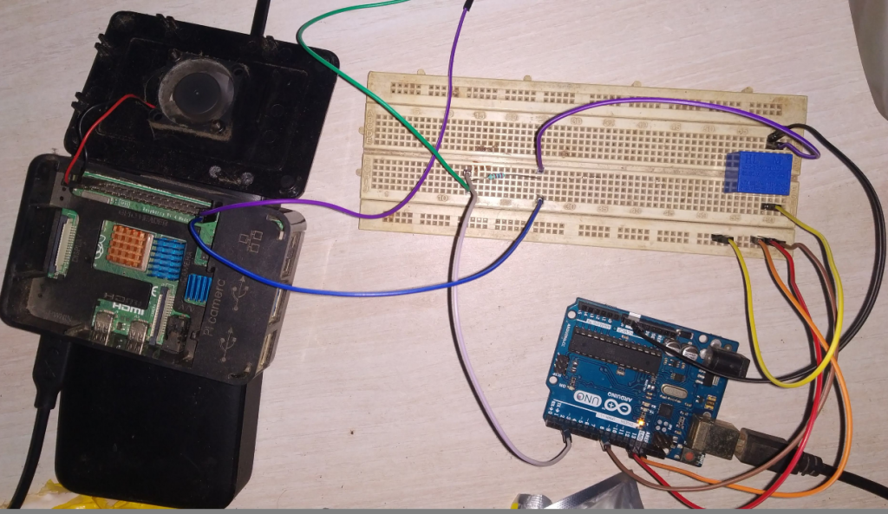

# Switch relay with Raspberry pi + Arduino Uno

The 5V Relay switch require around 52mA current to work properly.

- Raspberry pi max GPIO current with 5v Relay = ?
- Arduino pin 13 current with 5v Relay = `38.5mA`
- Arduino pin 13 + 12 current with 5v Relay = `45 mA`
- Arduino pin 13 + 12 + 8 current with 5v Relay = `47.3 mA` ( This worked )

So Now we can use Arduino as a switch on/off. Also I needed this switching to be based on some external events. So I used Aurdino Pin 2 as INPUT pin and added one 2.7K ohm resistor to from pin2 to Ground.



```c
int status = 0;

void setup() {
  pinMode(13, OUTPUT);
  pinMode(12, OUTPUT);
  pinMode(2, INPUT);
}

void loop() {
  status = digitalRead(2);
  if (status == HIGH) {
    digitalWrite(13, HIGH);
    digitalWrite(12, HIGH);
    digitalWrite(8, HIGH);
  }
  else {
    digitalWrite(13, LOW);
    digitalWrite(12, L0W);
    digitalWrite(8, LOW);
  }
}
```

#### Added Cronjob on Raspberry Pi 4

```bash
0 19 * * * /usr/bin/python3.8 /opt/led.py on
0 0 * * * /usr/bin/python3.8 /opt/led.py on
```

#### led.py

```python
import RPi.GPIO as GPIO
from time import sleep 
import sys

GPIO.setwarnings(False)
GPIO.setmode(GPIO.BCM)
GPIO.setup(21, GPIO.OUT, initial=GPIO.LOW)

if sys.argv[1] == "on":
    GPIO.output(21, GPIO.HIGH)
    #print("on")
    exit()
elif sys.argv[1] == "off":
    GPIO.output(21, GPIO.LOW)
    #print("off")
    exit()
```